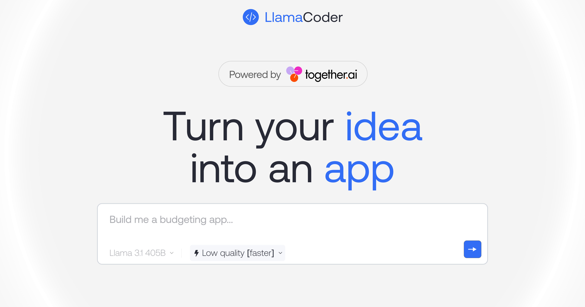

<a href="https://www.llamacoder.io">
  
  <h1 align="center">Llama Coder</h1>
</a>

  An open source Claude Artifacts – generate small apps with one prompt. Powered by Llama 3 on Together.ai.

> Production branch: `release/production-ready`. All authz, security, rate limits, encryption, tests and Design Mode rebuilt. See FINAL_PRODUCTION_PASS_PROMPT.md.

## Tech stack

- [Llama 3.1 405B](https://ai.meta.com/blog/meta-llama-3-1/) from Meta for the LLM
- [Together AI](https://togetherai.link/?utm_source=llamacoder&utm_medium=referral&utm_campaign=example-app) for LLM inference
- [Sandpack](https://sandpack.codesandbox.io/) for the code sandbox
- Next.js app router with Tailwind
- Helicone for observability
- Plausible for website analytics

## Cloning & running

1. Clone the repo: `git clone https://github.com/pichimail/llamacoder` (or the original [Nutlope/llamacoder](https://github.com/Nutlope/llamacoder))
2. Create a `.env` file and add your API keys:
   - **[Together AI API key](https://dub.sh/together-ai/?utm_source=example-app\&utm_medium=llamacoder\&utm_campaign=llamacoder-app-signup)**: `TOGETHER_API_KEY=<your_together_ai_api_key>`
   - **[CSB API key](https://codesandbox.io/signin)**: `CSB_API_KEY=<your_csb_api_key>`
   - **Database URL**: Use [Neon](https://neon.tech) to set up your PostgreSQL database and add the Prisma connection string: `DATABASE_URL=<your_database_url>`
3. Run `pnpm install` (or npm) and `pnpm dev` to install dependencies and run locally

## Deploying to Vercel

This app deploys easily to Vercel but requires some environment variables to be set **before or during** the first successful deployment.

1. Import this repository (or your fork) into [Vercel](https://vercel.com).
2. Go to **Project Settings → Environment Variables** and add the following (apply to Production, Preview, and Development):
   - `DATABASE_URL`: PostgreSQL connection string from [Neon](https://neon.tech) (use the pooled connection string recommended for serverless).
   - `TOGETHER_API_KEY`: Your Together AI key.
   - `CSB_API_KEY`: Your CodeSandbox key.
   - Optional: `HELICONE_API_KEY` for logging/observability.
3. Trigger a new deployment. The build will now succeed (we fixed the `prisma migrate deploy` step which was failing without `DATABASE_URL`).
4. **Run Prisma migrations** (required for the database tables to exist):
   - After setting `DATABASE_URL`, run locally: `pnpm prisma migrate deploy`
   - Or pull env with Vercel CLI and run it.
   - Do this whenever you change the Prisma schema (`prisma/schema.prisma`).

> **Why we changed the build script**: `prisma migrate deploy` was removed from `package.json` build command. It requires `DATABASE_URL` at build time (which isn't always configured immediately in Vercel) and running migrations on every deploy isn't ideal. Migrations are now a manual/one-time step.

## Contributing

For contributing to the repo, please see the [contributing guide](./CONTRIBUTING.md)
